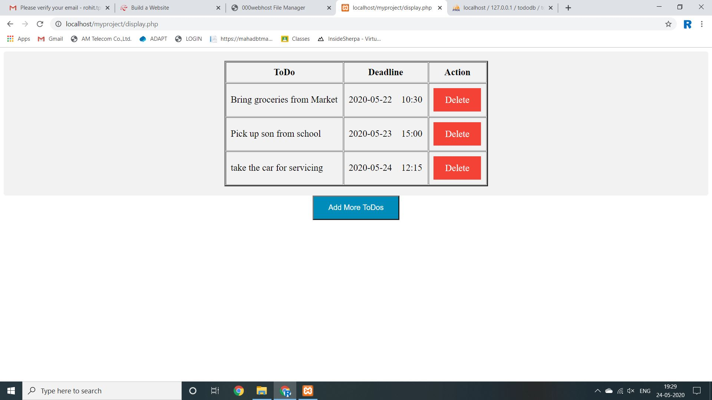

# create-a-todo-application-in-php
To create a todo application in php
### This project was developed for a internship task 
### The main task is to create a todo application using various web technologies like php, html, css, javascript, etc.
### Question

### Screenshots

